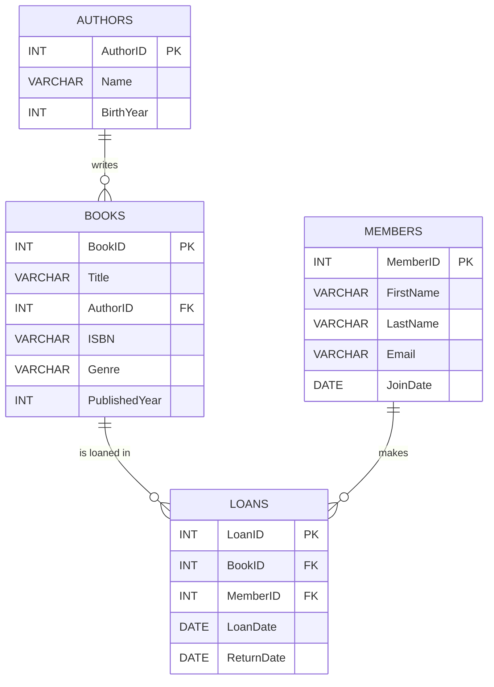

# **Lesson: Designing a Relational Database — Library Management System Example**

---

## **Lesson Goals**

By the end of this lesson, you will be able to:

* Identify real-world entities and represent them as database tables.
* Define table fields, choose primary keys, and understand foreign keys.
* Map out relationships between tables (one-to-many, many-to-many).
* Draw and interpret an Entity-Relationship Diagram (ERD).
* Understand how these concepts apply to any real-world system.

---

## **1. What is a Relational Database?**

A **relational database** stores data in tables that are connected by relationships. Each table represents an entity (like “Books” or “Members”), and connections are made through **keys**.

* **Table:** Collection of data organized in rows and columns (like a spreadsheet).
* **Row:** One record (e.g., a specific book).
* **Column:** A field/attribute (e.g., Title, AuthorID).

---

## **2. Step-by-Step: Designing a Database for a Library**

### **Step 1: Identify the Main Entities**

**Entities** are the real-world things we want to track.

For a Library System:

* **Book**
* **Member**
* **Author**
* **Loan**

These become our **tables**.

---

### **Step 2: Define Fields & Primary Keys**

Every table has:

* **Fields (columns):** Data items stored in each table.
* **Primary Key (PK):** A unique identifier for each row.

**Examples:**

| Table  | Primary Key | Other Fields                           |
| ------ | ----------- | -------------------------------------- |
| Book   | BookID      | Title, AuthorID, ISBN, Genre, Year     |
| Member | MemberID    | FirstName, LastName, Email, JoinDate   |
| Author | AuthorID    | Name, BirthYear                        |
| Loan   | LoanID      | BookID, MemberID, LoanDate, ReturnDate |

---

#### **Sample Table Definitions**

```sql
-- Books Table
CREATE TABLE Books (
  BookID INT PRIMARY KEY,
  Title VARCHAR(255),
  AuthorID INT,
  ISBN VARCHAR(20),
  Genre VARCHAR(50),
  PublishedYear INT
);

-- Members Table
CREATE TABLE Members (
  MemberID INT PRIMARY KEY,
  FirstName VARCHAR(100),
  LastName VARCHAR(100),
  Email VARCHAR(100),
  JoinDate DATE
);

-- Authors Table
CREATE TABLE Authors (
  AuthorID INT PRIMARY KEY,
  Name VARCHAR(255),
  BirthYear INT
);

-- Loans Table
CREATE TABLE Loans (
  LoanID INT PRIMARY KEY,
  BookID INT,
  MemberID INT,
  LoanDate DATE,
  ReturnDate DATE
);
```

---

### **Step 3: Set Up Relationships with Foreign Keys**

* **Foreign Key (FK):** A field that links to the primary key of another table.
* Connects the tables together and enforces referential integrity.

**Relationships in our system:**

| From Table | FK Field | To Table | Relationship                 |
| ---------- | -------- | -------- | ---------------------------- |
| Books      | AuthorID | Authors  | Many books per author (1\:N) |
| Loans      | BookID   | Books    | Many loans per book (1\:N)   |
| Loans      | MemberID | Members  | Many loans per member (1\:N) |

**Sample Foreign Key Syntax:**

```sql
ALTER TABLE Books ADD FOREIGN KEY (AuthorID) REFERENCES Authors(AuthorID);
ALTER TABLE Loans ADD FOREIGN KEY (BookID) REFERENCES Books(BookID);
ALTER TABLE Loans ADD FOREIGN KEY (MemberID) REFERENCES Members(MemberID);
```

---

### **Step 4: Draw the Schema (ERD)**

A **schema diagram** or **ERD** visually shows the tables and relationships.

#### **Visual Diagram (Mermaid Format)**



**How to read this diagram:**

* **||--o{** means “one-to-many.”
* Each **Author** can write many **Books**.
* Each **Book** can be loaned many times (many **Loans**).
* Each **Member** can have many **Loans**.

---

## **5. Explaining Relationships**

* **One-to-Many (1\:N):**
  One author writes many books, but each book has only one author.

* **Many-to-Many (N\:M):**
  If a book could have multiple authors, you’d need a junction table (e.g., BookAuthors) to manage this.

---

## **6. Example Data (Rows)**

| Books Table |                 |            |             |              |                |
| ----------- | --------------- | ---------- | ----------- | ------------ | -------------- |
| BookID      | Title           | AuthorID   | ISBN        | Genre        | PublishedYear  |
| --------    | --------------- | ---------- | ----------- | ------------ | -------------- |
| 1           | "Python 101"    | 2          | 123456789   | Programming  | 2021           |
| 2           | "Data Magic"    | 1          | 987654321   | Data         | 2022           |

| Members Table |             |            |                 |              |
| ------------- | ----------- | ---------- | --------------- | ------------ |
| MemberID      | FirstName   | LastName   | Email           | JoinDate     |
| ----------    | ----------- | ---------- | --------------- | ------------ |
| 10            | Alice       | Smith      | alice\@email    | 2023-01-15   |
| 11            | Bob         | Jones      | bob\@email      | 2023-03-20   |

| Authors Table |                |             |
| ------------- | -------------- | ----------- |
| AuthorID      | Name           | BirthYear   |
| ----------    | -------------- | ----------- |
| 1             | Jane Doe       | 1980        |
| 2             | John Python    | 1975        |

| Loans Table |          |            |              |               |
| ----------- | -------- | ---------- | ------------ | ------------- |
| LoanID      | BookID   | MemberID   | LoanDate     | ReturnDate    |
| --------    | -------- | ---------- | ------------ | ------------- |
| 100         | 1        | 10         | 2024-04-01   | 2024-04-21    |
| 101         | 2        | 11         | 2024-04-03   | 2024-04-23    |

---

## **7. Real-World Example: Querying the Database**

**a. Get all books by “Jane Doe”:**

```sql
SELECT Title
FROM Books
JOIN Authors ON Books.AuthorID = Authors.AuthorID
WHERE Authors.Name = 'Jane Doe';
```

**b. List all loans for Alice Smith:**

```sql
SELECT Loans.LoanDate, Books.Title
FROM Loans
JOIN Members ON Loans.MemberID = Members.MemberID
JOIN Books ON Loans.BookID = Books.BookID
WHERE Members.FirstName = 'Alice' AND Members.LastName = 'Smith';
```

---

## **8. Practice Exercise**

**Create your own ERD!**

1. Choose a different system (e.g., Hospital, School, Movie Rental).
2. Identify 3–4 main entities.
3. Define fields and keys for each table.
4. Map out the relationships.
5. Draw a schema diagram (hand-drawn or using a tool like [draw.io](https://draw.io), [dbdiagram.io](https://dbdiagram.io), or Mermaid live editor).

---

## **9. Key Takeaways**

* Every real-world system can be broken down into **entities**, **attributes**, and **relationships**.
* **Primary keys** ensure uniqueness; **foreign keys** create connections.
* **ERDs** help visualize the database before you start coding.
* This foundational design process makes your database reliable, scalable, and easy to query.

---

## **10. Extra Resources**

* [W3Schools SQL Tutorial](https://www.w3schools.com/sql/)
* [Mermaid Live Editor (for ERDs)](https://mermaid-js.github.io/mermaid-live-editor/)
* [Draw.io (ERD tool)](https://draw.io)
* [dbdiagram.io (online ERD)](https://dbdiagram.io)
* [SQLBolt (interactive SQL lessons)](https://sqlbolt.com)

---

## **Instructor Notes**

* Feel free to adapt this tutorial for any business domain (Retail, Healthcare, HR, etc.).
* Encourage students to draw diagrams by hand first before using tools.
* Assign peer review: Have students check each other’s ERDs for mistakes or improvements.

---

**Would you like this in Word or PDF, or want any screenshots/handouts or a quiz to go with it?**
