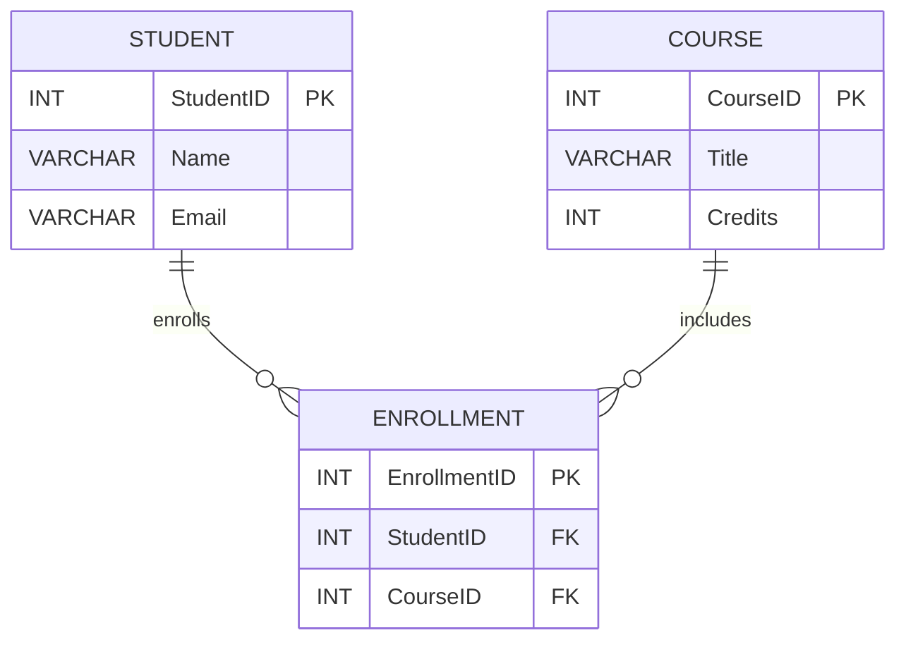
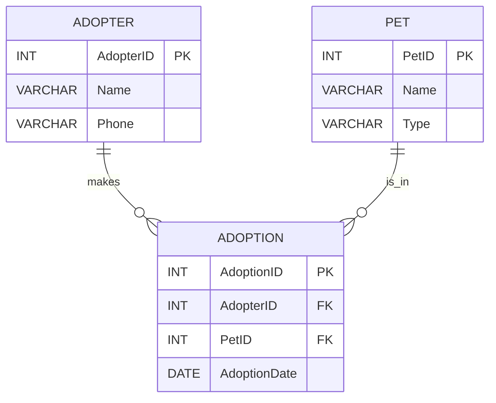

# **Mermaid for Beginners: Visualizing Diagrams with Markdown**

---

## **1. What is Mermaid?**

**Mermaid** is a text-based diagram tool. You write simple text in a special “Mermaid” syntax, and it creates clean diagrams—right inside Markdown, docs, GitHub, or Notion.

**Why use it?**

* Easy to learn (much easier than drawing by hand or in PowerPoint!)
* Perfect for ERDs, flowcharts, org charts, and more
* Portable—works in GitHub, GitLab, Obsidian, Notion, VS Code, etc.

---

## **2. Getting Started with Mermaid**

* Most Markdown editors support Mermaid, or you can use the [Mermaid Live Editor](https://mermaid-js.github.io/mermaid-live-editor/) to preview and export diagrams.
* Just put your Mermaid code inside three backticks and `mermaid`:

    <pre>
    ```mermaid
    <em>your diagram here</em>
    ```
    </pre>

---

## **3. The Basics: ER Diagram Syntax**

The **erDiagram** block is used to create Entity Relationship Diagrams (ERDs).
Key parts:

* **Table/entity name** (all caps by convention)
* **Relationship line**:

  * `||--o{` = one-to-many
  * `||--||` = one-to-one
  * `}o--o{` = many-to-many
* **Fields:** Listed inside `{ }` after the entity

---

### **Mermaid ERD Example**



---

## **4. Relationship Symbols Quick Reference**

| Mermaid Syntax | Meaning      | Example                 |             |           |            |             |   |    |   |             |
| -------------- | ------------ | ----------------------- | ----------- | --------- | ---------- | ----------- | - | -- | - | ----------- |
| \`             |              | --o{\`                  | one-to-many | AUTHOR \` |            | --o{\` BOOK |   |    |   |             |
| \`             |              | --                      |             | \`        | one-to-one | PERSON \`   |   | -- |   | \` PASSPORT |
| `}o--o{`       | many-to-many | STUDENT `}o--o{` COURSE |             |           |            |             |   |    |   |             |

---

## **5. Step-by-Step: Make an ERD with 3 Tables**

Let’s create an ERD for a **simple Pet Adoption System** with three entities:

* **Pet**
* **Adopter**
* **Adoption**

---

### **Step 1: Decide Your Entities**

Think: What nouns are important?

* Pet
* Adopter (person adopting)
* Adoption (the act—links Pet + Adopter)

---

### **Step 2: List Fields for Each Table**

**Pet:**

* PetID (PK)
* Name
* Type (dog/cat/etc)

**Adopter:**

* AdopterID (PK)
* Name
* Phone

**Adoption:**

* AdoptionID (PK)
* PetID (FK)
* AdopterID (FK)
* AdoptionDate

---

### **Step 3: Identify Relationships**

* Each **Pet** can be adopted once (one-to-one) or many times (depends—let’s say once for now)
* Each **Adopter** can adopt many Pets (one-to-many)
* The **Adoption** table joins Pet and Adopter

---

### **Step 4: Write Mermaid ERD Code**



---

### **Step 5: Render and Review**

* Copy your code to the [Mermaid Live Editor](https://mermaid-js.github.io/mermaid-live-editor/) or into any supported Markdown environment.
* Check:

  * **Three entities?** ✔️
  * **Primary keys?** ✔️
  * **Foreign keys?** ✔️
  * **Relationships?** ✔️

---

## **6. Your Turn — Student Practice**

**Prompt:**
Design an ERD for a basic Library System with three tables: **Book, Member, Loan**.

* Decide on **fields** for each.
* Mark the primary key (PK) and foreign keys (FK).
* Write the Mermaid code.
* Paste it into the Mermaid Live Editor and check your diagram!

**Start:**

```mermaid
erDiagram
  ...fill in here!
```

---

## **7. Extra Tips**

* You can add field types and PK/FK annotations for clarity (INT, VARCHAR, PK, FK).
* Use **all caps** for entity/table names for visibility (convention).
* Always check the relationships: Are they one-to-many or many-to-many?

---

## **8. Resources**

* [Mermaid Official Docs](https://mermaid-js.github.io/mermaid/#/entityRelationshipDiagram)
* [Mermaid Live Editor](https://mermaid-js.github.io/mermaid-live-editor/)
* [Markdown Guide: Mermaid](https://www.markdownguide.org/extended-syntax/#mermaid-diagrams)

---
